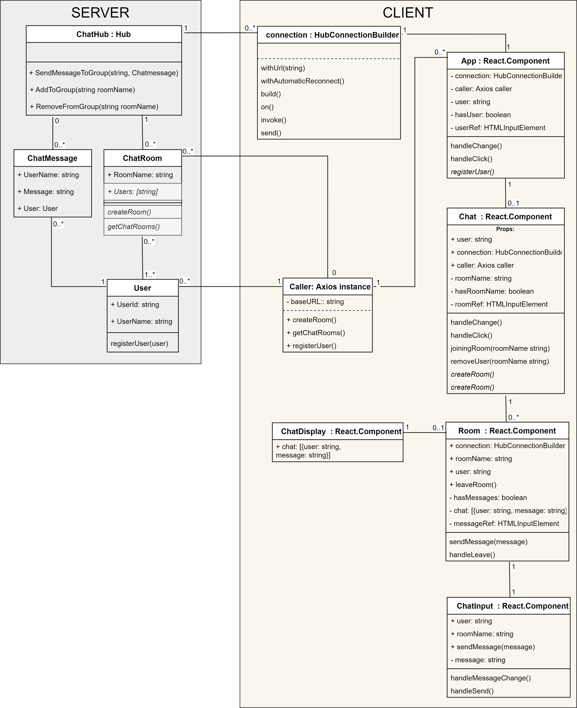
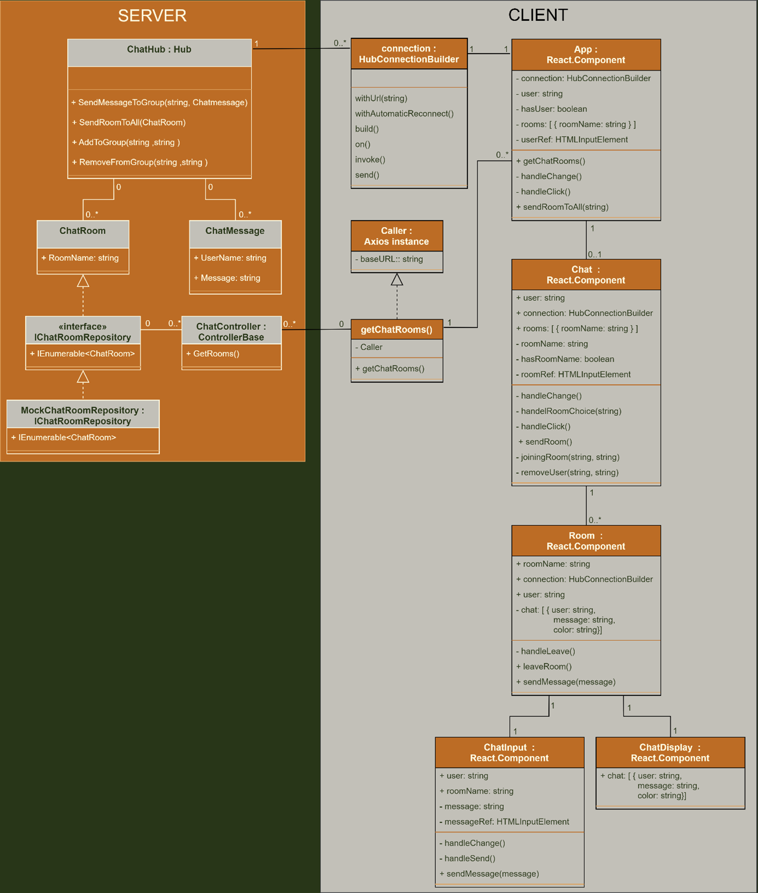
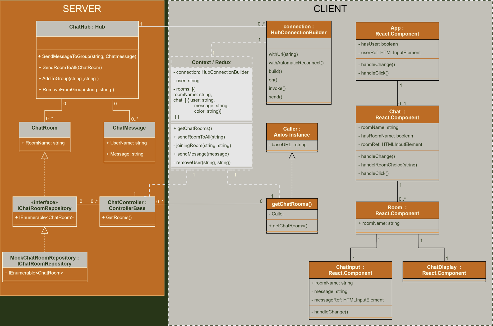
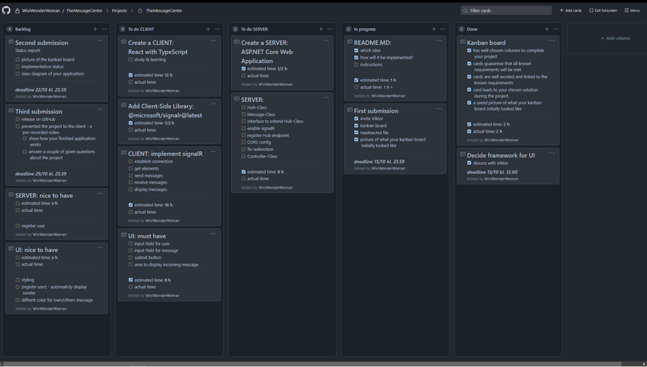
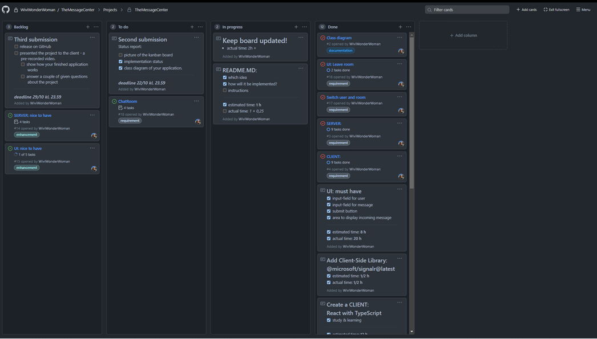

# TheMessageCenter
## Install
* open a terminal in the root-folder and type:
* ```cd chat-client``` 
* ```npm ci```
## Start the Server
* open a terminal in the root-folder and type:
* ```dotnet run -p ./Chat.Api/Chat.Api.csproj```

	**or**
* ```cd Chat.Api``` 
* ```dotnet run```
## Start the Client
* open a terminal in the root-folder and type:
* ```cd chat-client``` 
* ```npm start```
________________________________________________________________________________________________________________________________________________________________________________
________________________________________________________________________________________________________________________________________________________________________________
## System architecture
### Class diagram - Status report
*(Click on the image to enlarge)*



### Class diagram -  Current Status
*(Click on the image to enlarge)*



### Class diagram - Further development
*(Click on the image to enlarge)*



________________________________________________________________________________________________________________________________________________________________________________
________________________________________________________________________________________________________________________________________________________________________________
## Project planning
#### An ASP.NET Core SignalR Chat with a React TypeScript client
I've chosen to implement idea number 2, "*A chat where everyone can talk to each other, something like Slack.*" by using templets for:
* **dotnet webapi** for the server-side API
* **create-react-app --template typescript** for the client, a graphical user interface

To enable real-time communication I'll install @microsoft/signalr on the client.

### Initial plan
*(Click on the image to enlarge)*



NOTE:
* I could not fit all the cards in one To do column so I divided the cards by server and client. 
* I hope this picture is initial enough although I've already crossed tasks off and moved some cards.
________________________________________________________________________________________________________________________________________________________________________________
### Project status at Status report.
*(Click on the image to enlarge)*


